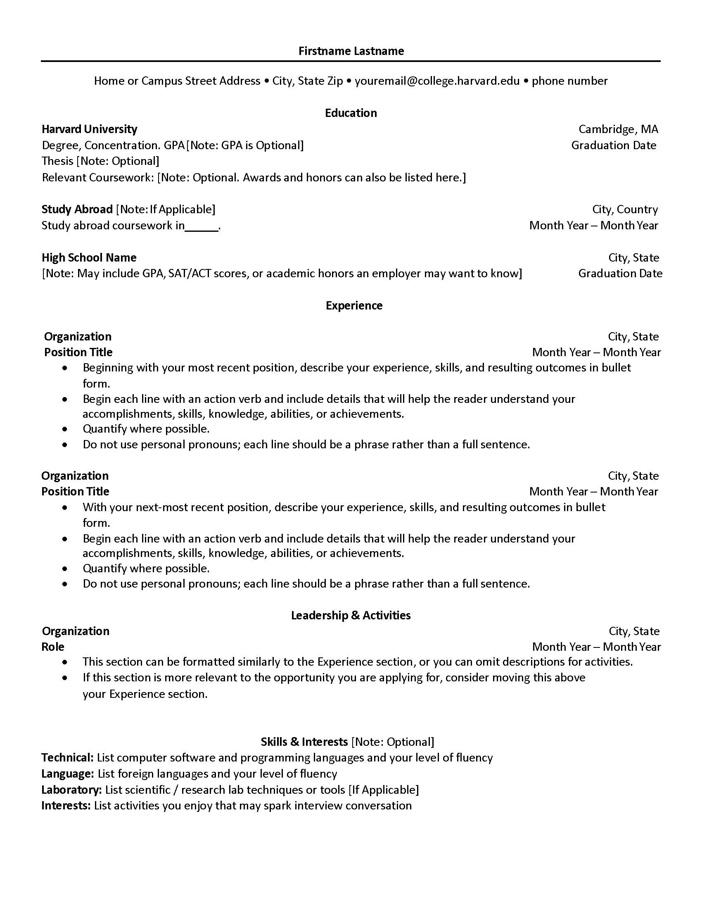
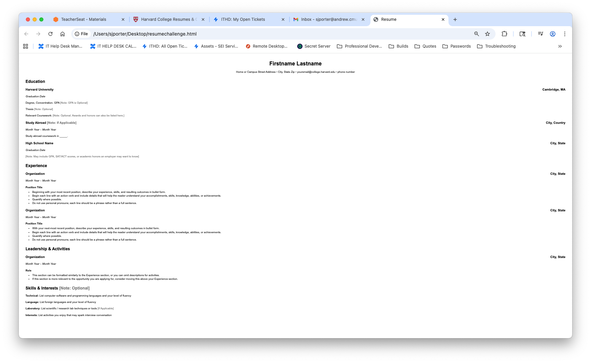

# Frontend Technical Specification

- Create a static website that serves a html resume.

## Resume Format Considerations

The resume must be formatted to clearly and concisely convey the applicant's suitability for the position. It should be easy to read and clearly present the relevant information from the applicant's work history and education. 

I will use the [Harvard Resume Template format](https://careerservices.fas.harvard.edu/resources/create-a-strong-resume/) as the basis of my resume.

### Harvard Resume Format Generation

I am learning HTML, so I'm going to let GenAI do the heavy lifting and generate the HTML and possibly CSS. Then, I will revise the code to my preferred standard.

Prompt to ChatGPT 5:

```text

Convert this resume into html. 
Please don't use a css framework. 
Please use the least amount of css tags
```

Image provided to LLM:


This is the [generated output](./docs/11-26-25-resumechallenge.html) that I will tweak.

This is what the generated HTML looks like unaltered:


## HTML Adjustments

- UT8 will support most languages, I plan to use English so I will leave this meta tag in. 
- We will also apply mobile styling to our website so we'll include the viewport meta tag width=device-width so mobile styling scales normally. 
- We'll extract our styles into its own stylesheet after we are happy with our HTML markup.
- We'll simplify our HTML markup css selector to be as minimal as possible. 
- I will use a tab for indent since I use python as my primary language. 

## Serve Static Website Locally

We need to server our static website locally so that we can start using stylesheets externally from our HTML page in a Cloud Developer Environment (CDE). 

> This is not necessary with local development. 

Assuming we have node install we'll use the simple web-server http-server

### Install HTTP Server
```sh
npm i http-server -g
```
https://www.npmjs.com/package/http-server

### Server Website

http-server will server a public folder by default whwere the command is run.

```sh
cd frontend
http-server
```
## Image Size Considerations

I generated a background image using Google Gemini Nano. I used GitHub CoPilot to optimize the image and add texture. 

## Frontend Framework Consideration

- Chose to use React because its the most popular javascript framework. 
- Chose to use Vite.js over webpack because our frontend is very simple
- Configured React Router version 7. Refined routing with the assistance of GitHub Copilot.


